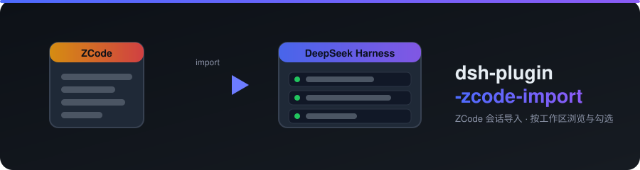

<p align="center">
  
</p>

# dsh-plugin-zcode-import

[English](README_EN.md) | 中文

[](LICENSE)
[](https://github.com/BaiZhi967/dsh-plugin-zcode-import)
[](package.json)

**把本地 ZCode 的会话导入 DeepSeek Harness**：设置面板里多一页「会话导入」，左边列出 ZCode 的工作区，右边列出该工作区的对话，勾选几条或整个工作区一键导入。导入后就是**原生 DSH 会话**——出现在左侧会话列表对应工作区下，能打开、能继续对话，不是导出一份文本。

- 直接读 ZCode 的 `db.sqlite`，**只读打开**，不改动、不迁移 ZCode 的任何数据；
- 会话 id 由 ZCode 的 UUID 派生，**重复导入会被识别为「已存在」**，不会产生副本；
- 全量导入很快：30 个会话约 3 秒（本机实测）。

## ✨ 功能

| 能力 | 说明 |
|---|---|
| **设置页入口** | 设置面板新增「会话导入」页（与「通用 / 模型 / 插件」同级），无需命令行 |
| **工作区列表** | 按 `session.directory` 自动聚合出 ZCode 工作区，显示会话数、最近更新时间；目录已被删除的会标黄提示 |
| **对话列表** | 选中工作区后列出其对话：标题、更新时间、消息条数、是否已导入；子代理会话默认折叠 |
| **部分导入** | 勾选任意几条 → 「导入选中会话」；「全选未导入」一键勾选 |
| **整工作区导入** | 「导入整个工作区」一次导入该工作区全部对话 |
| **进度与明细** | 导入过程有进度条 + 当前标题，结束后逐条列出「已导入 / 已存在 / 跳过 / 失败」及原因 |
| **内容完整** | 文本、思考（reasoning）、工具调用与工具结果全部还原成 DSH 的 `tool/call` + `tool/result` |
| **自动建工作区** | 目标目录在 DSH 里还没有工作区时自动创建并挂载，导入完即出现在侧栏 |
| **热重载** | 改 `impl.js` 后 `POST /__reload` 即可生效，不用重启 DSH；客户端改动由 DSH 模块热更新送达页面 |

## 📦 安装

```sh
# 从 GitHub 安装（本仓库）
dsh plugin --profile web add github:BaiZhi967/dsh-plugin-zcode-import
dsh --profile web
```

本地开发（clone 下来改）：

```sh
git clone https://github.com/BaiZhi967/dsh-plugin-zcode-import.git
cd dsh-plugin-zcode-import

# 在插件目录的「父目录」执行，dsh 会把相对路径锚定到调用目录
dsh plugin --profile web add ../dsh-plugin-zcode-import
dsh --profile web
```

也可以直接写进 profile 的 `cordis.patch.yml`：

```yaml
- insert:
    - id: zcode-import
      name: dsh-plugin-zcode-import
```

> 环境要求：DSH `>= 0.2.0-rc.2`、Node `>= 22.19.0`（用到内置 `node:sqlite`，需 Node 22.5+；本插件按 22.19 起算）。

装好后刷新一次页面，打开 **设置 → 会话导入**。

## 🚀 用法

1. 设置 → **会话导入**：顶部会显示识别到的 ZCode 数据目录；
2. 左栏点一个**工作区**；
3. 右栏勾选要导入的对话，点 **导入选中会话**；或直接点 **导入整个工作区**；
4. 进度条跑完看「导入明细」，然后关掉设置——会话已经在左侧列表里了。

导入的会话可以像平常一样打开、继续提问、归档或删除。删掉导入的会话不会影响 ZCode 原数据。

### 自定义 ZCode 位置

默认读 `<用户目录>/.zcode`。非标准安装用任一方式指定：

```sh
# 环境变量
setx ZCODE_HOME "D:\path\to\.zcode"
```

```yaml
# 或者写在 profile 的 cordis.patch.yml 里
- insert:
    - id: zcode-import
      name: dsh-plugin-zcode-import
      config:
        root: D:\path\to\.zcode
```

## 🔍 它是怎么工作的

### ZCode 侧的数据结构

ZCode 把会话存在 `<ZCode 根>/cli/db/db.sqlite`：

| 表 | 内容 |
|---|---|
| `session` | 会话元数据。**没有工作区表——工作区就是 `directory` 字段的去重分组**；`task_type` 区分 `interactive`（真人对话）与 `subagent_child`（子代理） |
| `message` | 一条消息一行，`data` JSON 含 `role` 与 `semantics.origin/kind`（`real_user` / `agent_runtime` / `system`） |
| `part` | 真正的内容：`text`、`reasoning`、`tool`（`state.input` + `state.output` 同时含调用与结果）、`step-start`、`step-finish`、`timeline`、`file` |

导入时会跳过运行时注入的提醒（`todo_reminder`、`background_notification` 等）和空的时间线标记。

### DSH 侧的数据结构

DSH 会话是**追加式事件日志**：`sessions/<projectKey(cwd)>/<session-id>/session.v4.jsonl.zstd`，zstd 多帧、首帧是 header、后续每帧是事件行。一条对话的事件序列是：

```
turn/start → step/start → user/message → assistant/message(含 stream)
           → tool/call + tool/result … → step/end → turn/end
```

两个容易踩的校验点：`user/message | assistant/message | tool/result` **必须**带 `surfaceOp: "append"`，而 `tool/call` **必须不带**。归属工作区由 `storages/workspace.json` 的 `sessionIds` 记录，并且会拿 header 里的 `cwd` 做校验。

### 导入路径

**不**手写 `session.v4.jsonl.zstd`——写入路径不做校验，而读取路径是 fail-closed 的，很容易做出「能列出但打不开」的会话。走运行时 API：

```
ZCode db.sqlite (只读)
      │  lib/zcode-source.js
      ▼
转换器 lib/convert.js  ──►  DSH 事件数组
      ▼
ctx.sessionPersistence.create(header) → append(events) → flush() → close()
      ▼
ctx.workspaceRegistry.create(cwd) + Workspace.attachSession(sessionId)
```

会话 id 由 ZCode 的 `sess_<uuid>` / `sess_subagent_agent_<uuid>` 派生为 `session-<uuid>`，所以重复导入会命中 `stat()` 判定为「已存在」，并补挂到工作区，而不是再存一份。

### 结构

```
dsh-plugin-zcode-import/
├── entry.js           # 宿主入口：只承载路由 + 热重载外壳
├── impl.js            # 宿主实现：工作区/对话列表、导入任务、落盘与挂载
├── client.js          # 客户端：设置页「会话导入」（locale 文案 + 主题令牌）
├── lib/
│   ├── zcode-source.js  # 只读打开 db.sqlite，列工作区/对话、读消息与 part
│   └── convert.js       # ZCode 消息/part → DSH 会话事件
├── tools/
│   ├── check-conversion.mjs  # 离线自检：转换 + 格式回环校验
│   └── verify-stored.mjs     # 落盘校验：用官方格式目录重读已导入会话
├── cordis.patch.yml   # bundle 补丁：向 profile 插入插件行
└── package.json       # dsh.bundle.patch + dsh.client 声明
```

```
设置页「会话导入」(client.js)
        │  同源 HTTP（回环地址）
        ▼
GET  /zcode-import/api/{status,workspaces,sessions}
POST /zcode-import/api/import          → { jobId }
GET  /zcode-import/api/job?id=…        → 进度与逐条结果
        ▼
impl.js ──► sessionPersistence / workspaceRegistry
```

宿主侧有意拆成两个文件：**加载过的 ESM 模块会在宿主进程里被永久缓存**，所以 `entry.js` 保持极简、逻辑放 `impl.js`，由它用带缓存参数的动态 `import()` 拉取——替换 `impl.js` 后一次 `POST /__reload` 就能生效。

### 本地 API

路由前缀 `/zcode-import/api`，仅监听 DSH 自己的回环地址：

| 方法 | 作用 |
|---|---|
| `GET /status` | ZCode 根目录、数据库路径、是否可用 |
| `GET /workspaces` | 工作区列表（`?includeSubagents=1` 带上子代理会话） |
| `GET /sessions?path=` | 某工作区的对话列表，含 `imported` 标记 |
| `POST /import` | `{path, sessionIds[]}`，空数组 = 整个工作区 → `{jobId}` |
| `GET /job?id=` | 任务进度、逐条结果 |
| `GET /__reload` | 开发用：重新加载 `impl.js` |

## ✅ 验证

仓库自带两个校验脚本，都用 **DSH 官方格式目录**（`@deepseek-ai/dsh-session-format-catalog`）做判据，而不是自说自话：

```sh
# 1) 转换器自检：把每个 ZCode 会话转成事件后编码成物理行、再走官方还原路径读回来
node tools/check-conversion.mjs 500

# 2) 落盘校验：把已导入的 session.v4.jsonl.zstd 逐帧解开、用官方目录还原
node tools/verify-stored.mjs "<DSH_HOME>/sessions"
```

本机实测（403 个真人会话 / 2.4 GB 级数据库）：

| 项目 | 结果 |
|---|---|
| 转换 + 格式回环 | **403 / 403 通过**，0 失败，共 236,060 个事件 |
| 已导入会话落盘还原 | **44 / 44 通过**，0 失败 |
| 真机导入 | MoTTEavl 6 个、PowerHuman 30 个，0 失败；30 个约 3 秒 |

> 脚本会自动定位 DSH 自带的 `@deepseek-ai/dsh-session-format-catalog`（依次尝试直接 import、`DSH_CHECKOUT` 环境变量、全局 npm 目录）。定位失败时按提示设置 `DSH_CHECKOUT` 指向 DSH 安装目录即可。

## ⚠️ 说明与限制

- **只读**：ZCode 数据库以 `readOnly` 打开，插件不写、不删、不迁移 ZCode 数据。
- **图片/附件**：ZCode 里的 `file` 类 part 只保留文件名占位文本；二进制附件不会搬运。
- **模型来源**：导入的 assistant 消息保留 ZCode 里记录的 provider / model 名（如 `GLM-5.3`）作为来源标注；这只影响展示，重新提问时用你当前选择的模型。
- **子代理会话**：默认不列出（ZCode 里 2642 个会话中 2237 个是子代理）。需要时用 `?includeSubagents=1`。
- **正在运行的会话**：导入的是 ZCode 数据库里的既存记录，ZCode 之后新产生的对话需要再导一次（重复的会被跳过）。

## 📄 License

[MIT](LICENSE) © 2026 BaiZhi967
